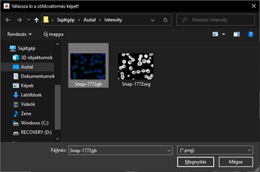
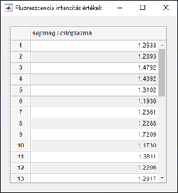

# Cellsegmention
This project was created to provide a medical application that can process an image of a cell taken by a microscope and calculate the average intensity of the cells.

## Table of Contents
 - [Reqirements / Environments](#reqirements)
 - [Using Converter and Segmentify](#converter)
 - [Display intensity ratio values](#intensity)

## Requirements / Environments 
---
- Python (>= 3.9.1)
- Python development environment, e.g. Anaconda Navigator
- Matlab Runtime 9.8

The fastest way to create a python environment is to use the **requirements.txt** file to create it, which contains all the necessary packages with the appropriate version.

The application adds the Segmentify package as a plugin to the Napari multi-dimensional image viewer. However, there is a bug in the package that needs to be fixed manually. Find the code for Segmentify *setup.py*. Delete the part that wants to use requirements.txt. (lines 7-14; line 45).

## Using Converter and Segmentify 
---
1. Start CziToPng.py from the terminal with the following command:
    > $ python CziToPng.py

    

2. In the window that appears, click the browse button. Then a pop-up window will appear, here you need to select the file with the czi extension you want to convert.
- 
- 

3. Then click the convert button to create the file with the .png extension and start the segmentify program, in which you need to segment the image.
- 

4. In segmentify, segmentation is based on labels. To do this, you need to add a labels layer, which can be done by clicking on the **label button** marked in red in the previous image.

5. 
By selecting the published labels layer, use the tools on the top left to color the image so that a given color indicates a part of the image to be separated. The easiest way to do this is with the brush tool highlighted in blue in the picture. 
 You can change the color with the plus and minus signs next to the labels. Three colors are required for proper operation. One color indicates the black background, another the nuclei highlighted in blue, and a third the green cytoplasm. The picture shows how the end result should look. 
 It is recommended to mark as many cells and background sections as accurately and as much as possible, as this will result in a more accurate segmented image.
- 

6. As soon as you find the labels appropriate, clicking the execute button in the lower right corner will create the segmented image in the folder of the originally opened image, with the same name and *"seg"* ending. The featurizer is still the HPA.pth. 

7. If you are segmenting a new image, you will need to restart the entire converter program from step 1.

## Display intensity ratio values 
---
1. Open the program called Intensity.

2. First, select the resulting segmented image.

    - 

3. The segmented image will then appear on the screen.

    - 

4. Then select the green channel image.

    - 

5. The labeled green channel image and the associated intensity ratio values will appear on the screen in a separate table.

    - 
    - 
